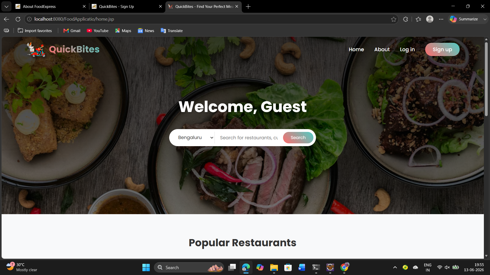
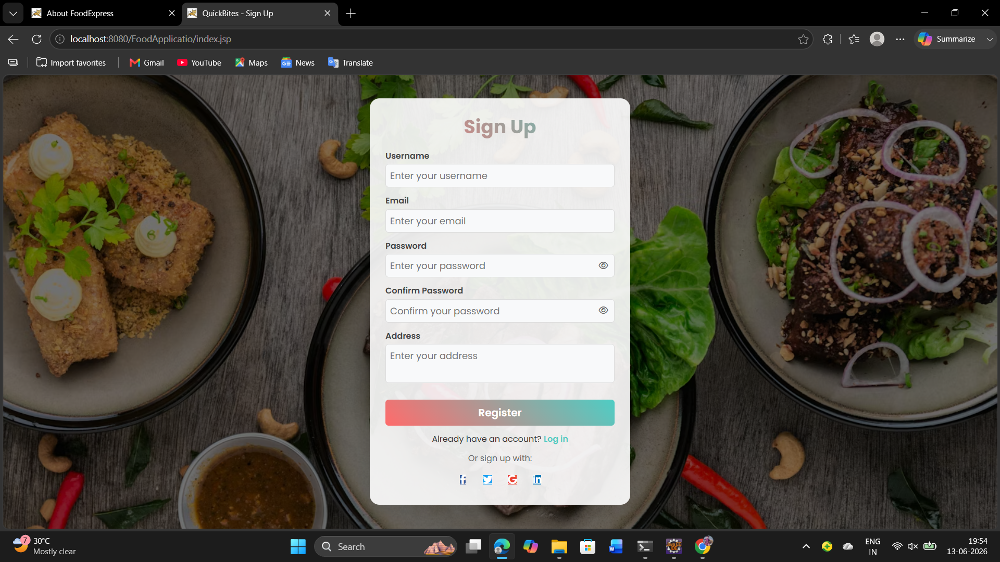
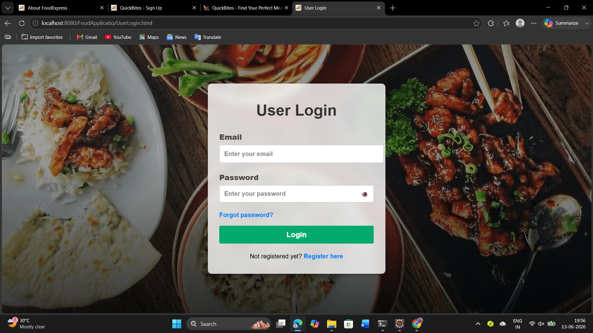
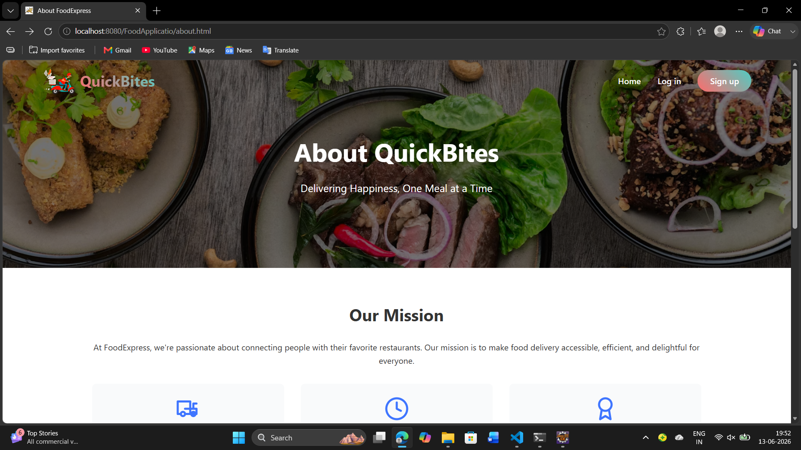
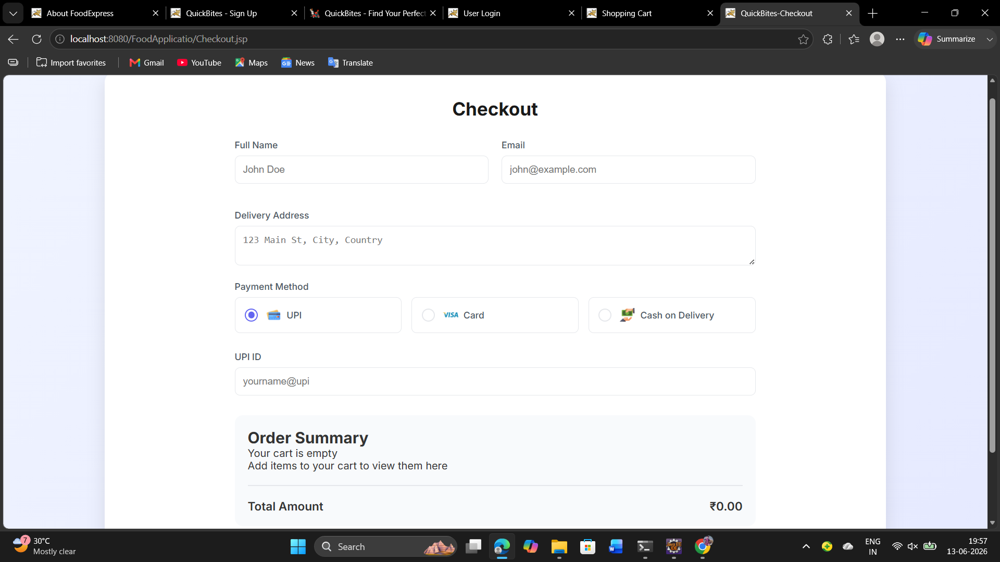

 QuickBites Food Delivery Web Application

 Overview

QuickBites is a Java-based Food Delivery Web Application that enables users to browse restaurants, explore food menus, add items to a cart, and place orders online. The project was developed to demonstrate full-stack web development skills using Java, JSP, Servlets, JDBC, MySQL, HTML, CSS, and JavaScript.

 Features

* User Registration and Login
* Restaurant Listing
* Food Menu Display
* Shopping Cart Functionality
* Order Placement
* Checkout Process
* Session Management
* Responsive User Interface

Tech Stack

 Backend

* Java
* JSP
* Servlets
* JDBC

 Frontend

* HTML5
* CSS3
* JavaScript

Database

* MySQL

 Tools

* Eclipse IDE
* Apache Tomcat
* Git & GitHub

 Project Structure

text
src/
build/
screenshots/
README.md

## Screenshots

 Home Page

 Registration Page

 Login Page

 About Page

 Checkout Page

 Learning Outcomes

* Developed a complete Java web application
* Implemented MVC architecture concepts
* Integrated MySQL database using JDBC
* Worked with session management and authentication
* Improved front-end and back-end integration skills

## Author

Geetha Sravanthi Nelakurthi

* GitHub: https://github.com/Geethasravanthi23
* LinkedIn: https://linkedin.com/in/geethasravanthi-nelakurthi-8b06ba259

